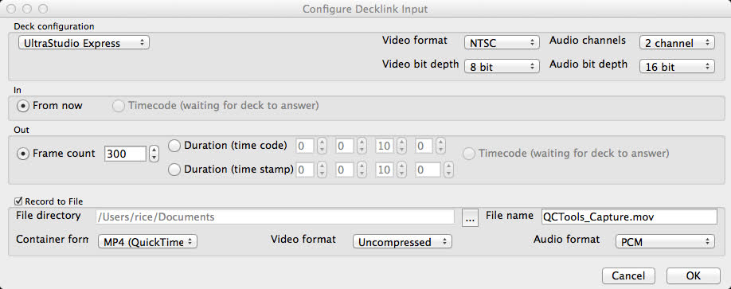

# QCTools Recording Feature

When QCTools is opened on a computer that has a supporting decklink device attachment a new Recording icon and toolbar menu will appear within the QCTools interface.

Clicking the icon will open a layout designed to set up recording instructions and the specifications of the resulting file.

Options include starting and ending time of the recording as well as video bit depth, audio bit depth, audio channel count, video codec and audio codec.

The starting point (in time) of the recording may be provided in two ways:

*   From now
*   Timecode

Specifying the starting point of the recording via timecode is only enabled if an RS-422 connection and a timecode can be detected.
The ending point (out time) of the recording may be set in one of four ways:

*   Frame count
*   Duration (time code)
*   Duration (time stamp)
*   Timecode from deck

Where a time code is an expression of time in hours, minutes, seconds, and frames, a time stamp is an expression of time in hours, minutes, seconds, and milliseconds. To capture twelve and a half seconds either set 'Duration (time stamp)' to 00 00 12 500 or if the frame rate is NTSC set 'Duration (time code)' to 00 00 12 15.

Clicking 'OK' in this dialog will start the recording and initiate an analysis of the audiovisual frames.

Please feel free to use the [QCTools issue tracker](https://github.com/bavc/qctools/issues/) to document recording issues while noticing the hardware involved, recording settings, and expected outcome.
